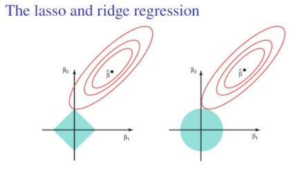

```{r setup, include = FALSE}
library(tidyverse)
library(dplyr)
library(glmnet)
library(ResourceSelection)
```


## **Problem 1**

**(10%) Explain the key differences between logistic regression and linear regression.**

| Key Difference | Linear Regression | Logistic Regression |
| --- | --- | --- |
| Response Variable ($Y$) | Continuous (e.g. height, weight) | Categorical, usually binary (e.g. pass/fail) |
| Link Function | Identity Function, $E[Y] = \mu$ | Logit link function to transform categorical y to a continuous scale, $log \left( \frac{\pi_i}{1-\pi_i} \right)=\beta_0 + \beta_1X$ |
| Assumptions | Linear relationship between $X$ and $Y$, independence of observations, normal distribution of error terms, homoscedasticity. | Linear relationship between $X$ and log-odds, response variable follows Bernoulli distribution, no strict normality assumption for residuals, no homoscedasticity assumption. |
| Interpretation | Outputs a continuous predicted value of Y. $\beta$ coefficients represent change in $Y$ per unit change in $X$. | Outputs change in log-odds per unit change in $X$. $exp[\beta]$ gives odds ratio. |


## **Problem 2**

**(10%) Define the concept of odds and log-odds in the context of logistic regression.**

In logistic regression, the response variable is categorical instead of continuous, typically taking on a Bernoulli distribution and encoded as binary values (0, 1). In order to perform regression analysis on a categorical variable, we use a link function (i.e. link logit) to transform the categorical variable into a continuous scale of log-odds. Odds are the likelihood of an event occurring compared to the likelihood of it not occurring. In this context, odds are the likelihood that the response variable will express as 1 as opposed to 0, or success as opposed to fail. Log-odds are simply the natural log of the odds. When interpreting any $\beta$ coefficients from a logistic model, it is important to remember the following:

$\beta_1$ = log(odds at $X_i$) - log(odds at $X_{i-1}$) = log(odds ratio)

To interpret $\beta_1$, we can exponentiate it to get the odds ratio. In other words:

Odds Ratio = $exp[\beta_1]$

## **Problem 3**

**(10%) Regularization prevents overfitting in logistic regression. Explain the difference between L1 (Lasso) and L2 (Ridge) regularization.**

LASSO and Ridge are both methods of regularization that control how large model coefficients can grow through penalties. The shrinkage penalty in both kinds of regression penalize when $\beta$ coefficients are farther from $0$. LASSO regularization uses L1 penalty, which penalizes the sum of absolute values of the weights (see below plot on left). Ridge regularization uses L2 penalty, which penalizes the sum of squares of the weights (see below plot on right). 



Due to the diamond- vs. circle-shaped constraints depicted above, Lasso and Ridge also deal with correlated predictors differently. LASSO will often remove all but one, whereas Ridge will typically reduce the coefficients of a set of correlated predictors proportionally to the number of correlated predictors. Due to the pros and cons of each approach, they are sometimes used in combination, through Elastic Net regularization.

## **Problem 4**

**(20%) Derive the score function and the Fisher information matrix for logistic regression.**

First let us derive the score function using the log likelihood function that we derived in class.

$$l(y, \pi_i) = \sum_{i=1}^n y_i log(\pi_i) + (1-y_i)log(1-\pi_i)$$
$$l(y, \pi_i) = \sum_{i=1}^n y_ilog\left(\frac{\pi_i}{1-\pi_i}\right)+log(1-\pi_i)$$
In order to write the log likelihood function in terms of $\beta$, let us recall the Bernoulli distribution Canonical Link function to find $\pi_i$ in terms of $\beta$.

$$\theta = log\left(\frac{\pi_i}{1-\pi_i}\right)=g(\pi_i)=x_i^T\beta$$
Most importantly:
$$log\left(\frac{\pi_i}{1-\pi_i}\right)=x_i^T\beta$$
Now let's solve for $\pi_i$.
$$\frac{\pi_i}{1-\pi_i}=exp[x_i^T\beta]$$
$$\pi_i = \frac{e^{x_i^T\beta}}{1+e^{x_i^T\beta}}$$
Now that we have $\pi_i$ in terms of $\beta$, let us find $log(1-\pi_i)$ in terms of $\beta$ as well.
$$1-\pi_i = 1-\frac{e^{x_i^T\beta}}{1+e^{x_i^T\beta}}$$
$$log(1-\pi_i)=-log(1+e^{x_i^T\beta})$$
Now let's plug those back into the log likelihood function from earlier.
$$l(\beta)=\sum_{i=1}^ny_ix_i^T\beta-log(1+e^{x_i^T\beta})$$
Now let's take the partial derivative of $l(\beta)$ with respect to $\beta$ in order to get the score function.
$$s(\beta)=\frac{\partial l(\beta)}{\partial\beta}=\sum_{i=1}^n y_i x_i-\frac{e^{x_i^T\beta}}{1+e^{x_i^T\beta}}\cdot x_i$$
Then we simplify this to get the score function.
$$s(\beta)=\sum_{i=1}^n x_i\left(y_i-\frac{e^{x_i^T\beta}}{1+e^{x_i^T\beta}}\right)$$
Next let's take the partial derivative of the score function with respect to $\beta$ so that we can use to get the Fisher equation.
$$I(\beta)=-E\left[\frac{\partial l^2(\beta)}{\partial \beta^2}\right]=-E\left[\frac{\partial s(\beta)}{\partial \beta}\right]$$
Apply the quotient rule.
$$\frac{\partial s(\beta)}{\partial \beta}=-\sum_{i=1}^nx_i \cdot \frac{(x_i^T \cdot e^{x_i^{T}\beta})(e^{x_i^T\beta})-(1-e^{x_i^T\beta})(e^{x_i^T\beta} \cdot x_i^T )}{(1+e^{x_i^T\beta})^2}$$
Simplify.
$$\frac{\partial s(\beta)}{\partial \beta}=-\sum_{i=1}^n x_i \cdot \frac{e^{x_i^T\beta} \cdot x_i^T}{(1+e^{x_i^T\beta})^2}$$
Finally, we have the Fisher Expectation function.
$$I(\beta)=-E\left[\frac{\partial s(\beta)}{\partial \beta}\right]=\sum_{i=1}^n  \frac{x_i \cdot e^{x_i^T\beta} \cdot x_i^T}{(1+e^{x_i^T\beta})^2}$$


## **Problem 5**

**(20%) The table below gives the data collected from a bioassay study in which X variable (treated as continuous variable) is the concentration level. At each of five different dose levels (0-4), 30 animals are tested and the number of dying are recorded.**


| Dose (X)  | Number Dying |
| ----------- | ----------- |
| 0 | 2 |
| 1 | 8 |
| 2 | 15 |
| 3 | 23 |
| 4 | 27 |

**Fit the model $g(P(dying))=\alpha + \beta X$, with logit, probit, and complementary log-log links.**

```{r}
# Dose Response data
dr_df = tibble(
  dose = 0:4,
  n_death = c(2, 8, 15, 23, 27),
  n_survive = 30 - n_death,
  p = n_death / 30
) |> 
  mutate(
    death = map2(n_survive, n_death, ~rep(c(0, 1), c(.x, .y)))
  ) |> 
  select(dose, death) |> 
  unnest(death)
```

**(a) Fill out the table and give comments.**

Logit Model
```{r}
# Generate Model
log_mod = glm(death ~ dose, data = dr_df, family = binomial(link = "logit"))

# Get Coefficients
log_b0 = coef(summary(log_mod))[1,1]
log_b1 = coef(summary(log_mod))[2,1]

# Get SE and CI
log_se = coef(summary(log_mod))[2,2]
log_ci_ll = log_b1 - 1.96*log_se
log_ci_ul = log_b1 + 1.96*log_se

# Get Residual Deviance
log_dev = summary(log_mod)$deviance

# Estimate p(dying|x=0.01)
log_odds = 0.01 * log_b1 + log_b0
log_pdeath = 1 / (1 + exp(-log_odds))
```

Probit Model
```{r}
# Generate Model
prob_mod = glm(death ~ dose, data = dr_df, family = binomial(link = "probit"))

# Get Coefficients
prob_b0 = coef(summary(prob_mod))[1,1]
prob_b1 = coef(summary(prob_mod))[2,1]

# Get SE and CI
prob_se = coef(summary(prob_mod))[2,2]
prob_ci_ll = prob_b1 - 1.96*log_se
prob_ci_ul = prob_b1 + 1.96*log_se

# Get Residual Deviance
prob_dev = summary(prob_mod)$deviance

# Estimate p(dying|x=0.01)
prob_odds = 0.01 * prob_b1 + prob_b0
prob_pdeath = pnorm(prob_odds)
```

C-Log-Log Model
```{r}
# Generate Model
cll_mod = glm(death ~ dose, data = dr_df, family = binomial(link = "cloglog"))

# Get Coefficients
cll_b0 = coef(summary(cll_mod))[1,1]
cll_b1 = coef(summary(cll_mod))[2,1]

# Get SE and CI
cll_se = coef(summary(cll_mod))[2,2]
cll_ci_ll = cll_b1 - 1.96*log_se
cll_ci_ul = cll_b1 + 1.96*log_se

# Get Residual Deviance
cll_dev = summary(cll_mod)$deviance

# Estimate p(dying|x=0.01)
cll_odds = 0.01 * cll_b1 + cll_b0
cll_pdeath = 1 - exp(-exp(cll_odds))
```


| Model  | Estimate of $\beta$ | CI for $\beta$ | Deviance | $\hat{p}(dying|x=0.01)|$
| ----------- | ----------- | ----------- | ----------- | ----------- |
| logit     | `r log_b1` | (`r log_ci_ll`, `r log_ci_ul`) | `r log_dev` | `r log_pdeath` |
| probit     | `r prob_b1` | (`r prob_ci_ll`, `r prob_ci_ul`) | `r prob_dev` | `r prob_pdeath` |
| c-log-log     | `r cll_b1` | (`r cll_ci_ll`, `r cll_ci_ul`) | `r cll_dev` | `r cll_pdeath` |

**Comments:** In each of the three models above, the beta coefficient has a different interpretation. In the logit model, it means that for a one-unit increase in dose, the log-odds of death will increase by `r log_b1 |> round(2)`. In the probit model, it indicates the change probability of death expected for a unit increase in dose, expressed on the standard normal distribution scale. In the c-log-log model, it represents the effect of the dose on the log of the complementary hazard.

Since all three beta coefficients represent very concepts, we cannot directly compare their values. However, we can assess their confidence intervals and their deviance values. Based on the confidence intervals, all three models are statistically significant, since no confidence interval includes 0. The deviance values are quite close to each other, although the logit and probit models have slightly lower deviance than c-log-log, indicating that they may have fit the data better. 

As for the point estimates, the three models estimate that the probability of dying associated with a dose level of 0.01 is about 9% (logit), 8.5% (probit), and 12.8% (c-log-log). Since the logit and probit models have slightly lower deviance, and their estimates are much closer to each others' than to that of c-log-log, one could presume that the true value of $\hat{p}(dying|x=0.01)$ might be closer to the range of 8.5% or 9%.

**(b) Suppose that the dose level is in natural logarithm scale, estimate LD50 with 90% confidence interval based on the three models.**

To calculate the lethal dose for 50% of the population, let us first solve each of the link functions for X and then compute the point estimate and CI for LD50.

Logit Model

_Assuming dose level is in ln scale._

$$log\left(\frac{\pi}{1-\pi}\right)=\beta_0 + \beta_1 ln(X)$$
$$log\left(\frac{0.5}{1-0.5}\right)=\beta_0 + \beta_1 ln(X)$$
$$0=\beta_0 + \beta_1 ln(X)$$
$$X = exp \left[- \frac{\beta_0}{\beta_1}\right]$$

```{r message = FALSE}
# Get point estimate
LD50_logit_x = exp(-log_b0 / log_b1)

# Parameters needed to calculate CI
log_b0_ll = log_b0 - 1.645 * coef(summary(log_mod))[1, 2]
log_b0_ul = log_b0 + 1.645 * coef(summary(log_mod))[1, 2]
log_b1_ll = log_b1 - 1.645 * coef(summary(log_mod))[2, 2]
log_b1_ul = log_b1 + 1.645 * coef(summary(log_mod))[2, 2]

# Compute 90% confidence interval
LD50_logit_x_ll = exp(- log_b0_ll / log_b1_ul)
LD50_logit_x_ul = exp(- log_b0_ul / log_b1_ll)
```

**Result:** The LD50 as estimated by the logit model is a dose level of `r LD50_logit_x`, with a 90% confidence interval of `r LD50_logit_x_ll` to `r LD50_logit_x_ul`.


Probit Model

_Assuming dose level is in ln scale._

$$\pi = \phi (\beta_0 + \beta_1 \cdot ln(X)$$
$$0 = \beta_0 + \beta_1 \cdot ln (X)$$
$$X = exp\left[- \frac{\beta_0}{\beta_1}\right]$$
```{r message = FALSE}
# Get point estimate
LD50_probit_x = exp(- prob_b0 / prob_b1)

# Parameters needed to calculate CI
probit_b0_ll = confint(prob_mod, level = 0.9)[1,1]
probit_b0_ul = confint(prob_mod, level = 0.9)[1,2]
probit_b1_ll = confint(prob_mod, level = 0.9)[2,1]
probit_b1_ul = confint(prob_mod, level = 0.9)[2,2]

# Compute 90% confidence interval
LD50_probit_x_ll = exp(-probit_b0_ll / probit_b1_ll)
LD50_probit_x_ul = exp(-probit_b0_ul / probit_b1_ll)
```

**Result:** The LD50 as estimated by the probit model is a dose level of `r LD50_probit_x`, with a 90% confidence interval of `r LD50_probit_x_ll` to `r LD50_probit_x_ul`.


_Assuming dose level is in ln scale._

$$0.5 = 1 - exp(-exp(\beta_0 + \beta_1 \cdot X))$$
$$X = \frac{exp\left[-log(-log(0.5)) - \beta_0\right]}{\beta_1}$$

```{r message = FALSE}
# Get point estimate
LD50_cll_x = exp((-log(-log(0.5))) - cll_b0) / cll_b1

# Parameters needed to calculate CI
cll_b0_ll = confint(prob_mod, level = 0.9)[1,1]
cll_b0_ul = confint(prob_mod, level = 0.9)[1,2]
cll_b1_ll = confint(prob_mod, level = 0.9)[2,1]
cll_b1_ul = confint(prob_mod, level = 0.9)[2,2]

# Compute 90% confidence interval
LD50_cll_x_ll = exp((-log(-log(0.5))) - cll_b0_ll) / cll_b1_ul
LD50_cll_x_ul = exp((-log(-log(0.5))) - cll_b0_ul) / cll_b1_ll
```

**Result:** The LD50 as estimated by the c-log-log model is a dose level of `r LD50_cll_x`, with a 90% confidence interval of `r LD50_cll_x_ll` to `r LD50_cll_x_ul`.


## **Problem 6**

**(30%) The table below contains the enrollment data of some MPH program in a year**

* **Amount (in thousand dollars): one-time two-year scholarship**
* **Offer: the number of offers made with the corresponding scholarship**
* **Enrolls: the number of offer accepted**

```{r}
mph_df = tibble(
    amount = c(10, 15, 20, 25, 30, 35, 40, 45, 50, 55, 60, 65, 70, 75, 80, 85, 90),
    offers = c(4, 6, 10, 12, 39, 36, 22, 14, 10, 12, 8, 9, 3, 1, 5, 2, 1),
    n_enroll = c(0, 2, 4, 2, 12, 14, 10, 7, 5, 5, 3, 5, 2, 0, 4, 2, 1),
    n_not_enroll = offers - n_enroll
  ) |> 
  mutate(
    enroll_data = map2(n_not_enroll, n_enroll, ~rep(c(0, 1), c(.x, .y)))
  ) |> 
  select(amount, enroll_data) |> 
  unnest(enroll_data)

head(mph_df, 10)
```

**Please analyze the data using a logistic regression and answer the following questions:**

```{r}
fit = glm(enroll_data ~ amount, data = mph_df, family = binomial(link = 'logit'))
```

**(a) How does the model fit the data?**

First let's get a summary of the model. It appears that the p-value is significant.
```{r}
summary(fit)
```

Using the Hosmer-Lemeshow test to test for goodness of fit for logistic regression model.
```{r}
h_test = hoslem.test(fit$y, fitted(fit), g = 2)
h_test
```

The model fits the data well. The Hosmer-Lemeshow test fails to reject the fit, as the p-value is very small: < 2.2e-16.

**(b) How do you interpret the relationship between the scholarship amount and enrollment rate? What is 95% CI?**

```{r}
b1 = fit$coefficients
exp(b1)
```

There is a statistically significant positive association between scholarship amount and enrollment rate. A $1000 increase in scholarship amount offered is associated with 1.03 times the odds of enrollment, with a 95% confidence intervavl of 1.01 to 1.05.

```{r}
CI1=fit$coefficients + kronecker(t(c(0,qnorm(0.025),-qnorm(0.025))),t(t(sqrt(diag(vcov(fit))))))
out=cbind(exp(CI1)[-1,,drop=FALSE],coef(summary(fit))[-1,4,drop=FALSE])
colnames(out)=c('OR','95% LL','95% UL','p-value')
rownames(out)=c('Enrollment')
out
```

**(c) How much scholarship should we provide to get 40% yield rate (the percentage of admitted students who enroll?) What is the 95% CI?**

```{r}
# Desired probability
p_y1 = 0.4

# Get coefficients
b0 = fit$coefficients[[1]]
b1 = fit$coefficients[[2]]

# Get SE
se_b0 = summary(fit)$coefficients[1,2]
se_b1 = summary(fit)$coefficients[2,2]

# Compute point estimate for x
logit_p = log(p_y1 / (1 - p_y1))
x = (logit_p - b0) / b1

# Compute 95% CI
se_x <- sqrt(se_b0^2 + (logit_p * se_b1)^2) / abs(b1)
ci_ll = x - 1.96 * se_x
ci_ul = x + 1.96 * se_x
```

Based on the logistic model above, I estimate that offering a scholarship amount of `r x |> round(2)` thousand dollars will get a 40% yield rate, with a 95% confidence interval of `r ci_ll |> round(2)` to `r ci_ul |> round(2)` thousand dollars.


